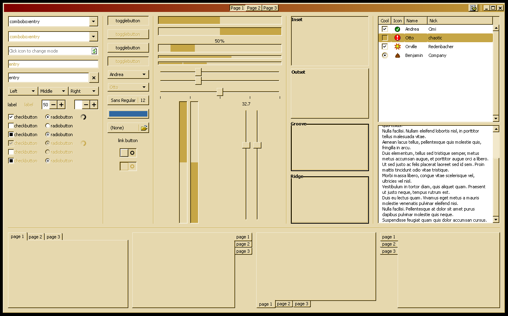

# Color Schemes

## 2000, Light

### Standard

### Classic

### Brick

### Desert

### Eggplant

### High Contrast (White)

### Lilac

### Maple

### Marine

### Plum

### Pumpkin

### Rainy Day

### Red White and Blue

### Rose

### Slate

### Spruce

### Storm

### Teal

### Wheat

## 2000, Dark

(coming soon)

## 98, Light

(coming soon)

## 98, Dark

(coming soon)